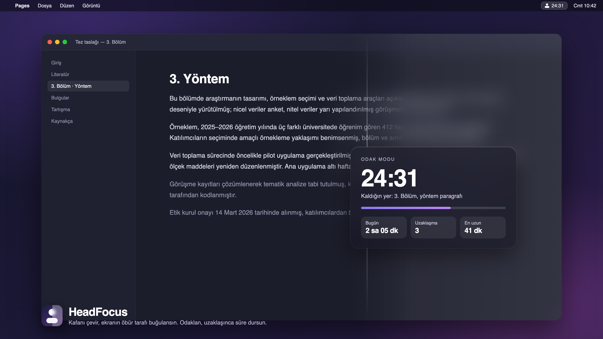

# HeadFocus

<p align="center"></p>

AirPods'un kafa takibini kullanan küçük bir macOS menü çubuğu uygulaması.
Kafanı hangi tarafa çevirirsen ekranın **öbür** tarafı cam gibi buğulanır;
odak modunda ekrandan uzaklaşınca sayaç durur, dönünce kaldığı yerden sürer.

## Amaç

Büyük ekranda çalışırken dikkat sürekli bakmadığın tarafa kaçar: bildirim,
açık kalan sohbet, arka plandaki video. HeadFocus bunu donanımla değil
alışkanlıkla çözüyor: baktığın yer net, bakmadığın yer buğulu. Ekrana
dönmek için ekstra bir şey yapmıyorsun, kafanı çevirmen yetiyor.

Aynı sensör üç işe daha yarıyor:

- **Odak modu**: 25 dakikalık bir oturum boyunca ekrana bakmak "kural";
  uzaklaşınca ekran tamamen buğulanıp süre duruyor. Pomodoro'nun kendini
  kandıramayan hâli.
- **Sağlık**: başın uzun süre öne eğik kaldığında nazik bir hatırlatma.
- **Erişilebilirlik**: kafayla kaydırma, kafayla imleç, sabit bakınca tıklama.

Ücretsiz ve açık kaynak. Veri cihazdan çıkmıyor; istatistikler yerel bir
JSON dosyasında.

## Kurulum

### Hazır paket (önerilen)

1. [Releases](https://github.com/Voxyfy/headfocus/releases) sayfasından
   en yeni `HeadFocus-x.y.z.dmg` dosyasını indir.
2. DMG'yi aç, **HeadFocus**'u **Applications** klasörüne sürükle.
3. Uygulamayı aç. Dock'ta görünmez; menü çubuğunda baş silüeti simgesi belirir.
4. AirPods'u tak. İlk veri geldiğinde macOS **Hareket ve Fitness** izni
   sorar; "İzin ver" de. Menüdeki ilk satır "Bağlı · yön … · eğim …" olunca
   çalışıyor demektir.

Paket Developer ID ile imzalı ve Apple noter onaylı; Gatekeeper uyarısı
vermez. Açılışta otomatik başlaması için menüden **Açılışta başlat**.

### İsteğe bağlı izinler

| İzin | Ne için | Nerede |
| --- | --- | --- |
| Hareket ve Fitness | Kafa yönü (zorunlu) | İlk açılışta sorulur |
| Ekran Kaydı | Yarıçaplı bulanıklık (Bulanıklık menüsünde px seçince) | Sistem Ayarları → Gizlilik ve Güvenlik → Ekran Kaydı |
| Erişilebilirlik | Kafayla kaydırma, masaüstü geçişi, imleç | Menü → Kafa hareketleri → Erişilebilirlik izni ver… |
| Bildirimler | Odak bitince ve duruş uyarısında | İlk açılışta sorulur |

Hiçbirini vermezsen sistem camı kipinde yan bulanıklık ve odak modu yine çalışır.

### Gereksinimler

- macOS 14 Sonoma veya üstü. Liquid Glass görünümü için macOS 26+.
- Kafa takibi destekleyen kulaklık: AirPods Pro (tüm nesiller), AirPods 3 ve
  sonrası, AirPods Max, Beats Fit Pro ve benzerleri. Mac'e bağlı olması
  yeterli, ses çalması gerekmiyor.
- Apple silicon önerilir; Intel'de de çalışır, yarıçaplı bulanıklık daha
  çok CPU harcar.

### Kaldırma

`/Applications/HeadFocus.app` dosyasını çöpe at. Ayarlar
`~/Library/Preferences/com.batuhanhaymana.headfocus.plist`, istatistikler
`~/Library/Application Support/HeadFocus/` altında; istersen onları da sil.

## Hızlı başlangıç

1. Menü çubuğundaki simgeye tıkla, **Ekran boyutu**'nu seç (dizüstü /
   masaüstü / büyük ekran). Eşikler buna göre ayarlanır.
2. Ekranın ortasına bakıp **Düz bakışı sıfırla** (⌃⌥R). Kulaklık her
   bağlandığında bu kendiliğinden olur.
3. Kafanı sağa çevir: sol taraf buğulanmalı. Az geliyorsa **Hassasiyet →
   Yüksek**, çok geliyorsa **Bulanıklık** menüsünden daha küçük bir yarıçap.
4. **Odak modu → 25 dakika** ile bir oturum başlat; ne üzerinde çalıştığını
   yaz, ekrandan uzaklaşıp geri dönünce hatırlatılır.

## Kaynaktan derleme

```sh
git clone https://github.com/Voxyfy/headfocus.git
cd headfocus
./build.sh            # build/HeadFocus.app
open build/HeadFocus.app
```

Xcode komut satırı araçları yeterli, Xcode projesi yok (SwiftPM). Betik
derleyip ikiliyi bir .app paketine koyar, simgeyi ve Info.plist'i ekler,
Keychain'de Apple Development sertifikası varsa onunla, yoksa geçici
imzayla imzalar. Geçici imzada izinler her derlemede yeniden sorulur.

## Yayınlama

```sh
./release.sh 0.2.0                # build/HeadFocus-0.2.0.dmg
GH_RELEASE=1 ./release.sh 0.2.0   # + GitHub Release (gh gerekir)
```

Betik sürümü Info.plist'e yazar, derler, Keychain'de **Developer ID
Application** sertifikası varsa hardened runtime ile imzalar, DMG üretir,
`headfocus-notary` adlı notarytool profili varsa Apple'a gönderip mührü
basar. Tek seferlik hazırlık betiğin başındaki yorumda. Noter onayı ilk
gönderimlerde bir saati bulabiliyor.

## Menü

| Öğe | Ne yapar |
| --- | --- |
| Durum satırı | Bağlantı, anlık yön ve eğim; izin sorunlarını da burada söyler |
| Yan bulanıklık ⌃⌥B | Özelliği açar kapatır |
| Düz bakışı sıfırla ⌃⌥R | Şu anki bakışı "düz" kabul eder |
| Bulanıklık | Tailwind ölçeği: xs 4 px … 3xl 64 px, ya da "Tam · sistem camı" |
| Cam türü / Bulanıklık gücü | Yalnızca sistem camında: koyu/açık buzlu cam, sade, Liquid Glass; karartma ve katman |
| Görünüm | Yönü ters çevir, Hassasiyet (8/12/20°), Ekran boyutu, Hangi ekranlar (tümü / ana / imlecin olduğu) |
| Şu uygulamalarda kapat | Açık uygulamaların listesi; işaretlenen öndeyken bulanıklık durur (film, sunum) |
| Odak modu | 15 / 25 / 50 dk veya özel süre; mola sayacı, uzaklaşınca sesi kıs, Rahatsız Etmeyin, dönüş notu |
| Odak modunu bitir ⌃⌥F | Kısayol aynı zamanda 25 dk oturum başlatır |
| İstatistikler… ⌃⌥S | Haftalık odak dakikası, bugünkü uzaklaşma sayısı, dikkat ısı haritası |
| Kafa hareketleri | Kafayla kaydırma, masaüstü geçişi, duruş uyarısı, ısı haritası, kafayla imleç, sabit bakınca tıkla |
| Açılışta başlat | Login Item |

## Özellikler ayrıntı

**Odak modu.** Oturum başında "ne üzerinde çalışıyorsun" sorusu (kapatılabilir);
ekrandan uzaklaşıp dönünce not küçük bir baloncukla hatırlatılır. Uzaklaşınca
ses kısılabilir, dönünce açılır. Odak bitince istenirse mola sayacı başlar
(varsayılan 5 dk, menü çubuğunda ☕ ile). Her oturum istatistiğe yazılır:
planlanan ve gerçek odak süresi, uzaklaşma sayısı, en uzun kesintisiz süre.

**Rahatsız Etmeyin.** macOS odak modunu açan açık bir API yok; uygulama
Kısayollar'daki iki kısayolu çalıştırır. Bir kez oluşturman gerekir:
1. Kısayollar → yeni kısayol, adı **HeadFocus Odak Aç**, eylem "Odak Ayarla":
   Rahatsız Etmeyin, Aç, Kapatılana kadar.
2. Aynı şekilde **HeadFocus Odak Kapat**, eylem "Odak Ayarla": Kapat.
Kısayol yoksa seçenek sessizce hiçbir şey yapmaz.

**Kafa hareketleri.** Kaydırma, masaüstü geçişi ve imleç sistem olayı
gönderdiği için **Erişilebilirlik** izni ister (menüden "Erişilebilirlik
izni ver…"). Kaydırma: 14° ölü bölge, eğim arttıkça hızlanır. Masaüstü
geçişi: 50° + ekran payını hızlı geçince Ctrl+← / Ctrl+→ gönderir, yeniden
tetiklenmek için 30°'nin altına inmek gerekir. Kafayla imleç: ±25° yatay
ve ±18° dikey ana ekrana yayılır; "sabit bakınca tıkla" imleç 1,2 sn
yerinde durunca tıklar. Duruş uyarısı: baş 15°'den fazla öne eğik seçilen
süre boyunca kalırsa baloncuk ve bildirim. Isı haritası: 2,5 Hz ile
bakılan açı 9×5 hücreye sayılır, İstatistikler penceresinde görünür.

**Kısayollar.** ⌃⌥F odak başlat/bitir, ⌃⌥B bulanıklık, ⌃⌥R sıfırla,
⌃⌥S istatistikler. Carbon hot key kullanıldığı için ek izin istemez.

## Nasıl çalışıyor

**Kafa yönü.** CoreMotion'ın kulaklık hareket yöneticisi (`CMHeadphoneMotionManager`)
25 Hz civarında yön verisi veriyor. Sağa sola dönüş (yaw) mutlak değil,
jiroskoptan birikiyor ve zamanla kayıyor. Bu yüzden:

- Kulaklık bağlandığında ilk örnek "düz bakış" referansı olur.
- Kafa sabitken ve referansa 25° içinde bakarken referans yavaşça o yöne
  kayar (yaklaşık 6 saniyelik zaman sabiti). Varsayım: zamanın çoğunda
  ekrana bakıyorsun. Bedeli: yan ekrana dakikalarca sabit bakınca referans
  oraya kayar; ⌃⌥R ile düzelir.
- Yukarı bakış hiçbir yerde sayılmaz, büyük ekranın üstüne bakmak kafayı
  kaldırır.

**Şerit.** Başlangıç açısında ince bir şerit çıkar, 22° sonra ekranın
yarısını kaplar. Genişlik yaylı bir yumuşatmadan geçer, iç kenarda 220
piksellik saydamdan opağa geçiş vardır.

**İki bulanıklık kipi.**

- *Sistem camı*: her ekranın üstünde tıklamaları geçiren şeffaf pencereler,
  içinde `NSVisualEffectView` (ya da macOS 26'da `NSGlassEffectView`).
  Sistem arkadaki her şeyi bulanıklaştırır ama yarıçap sabittir. "Bulanıklık
  gücü" bunu üst üste birkaç pencereyle (her biri alttakini bir kez daha
  bulandırır, kenara doğru artan kademeli bulanıklık) ve hafif karartmayla
  artırır.
- *Yarıçaplı*: ekran ScreenCaptureKit ile kendi pencerelerimiz hariç
  yakalanır, CoreImage ile seçilen yarıçapta bulanıklaştırılır ve şerit
  bölgesine basılır. Yakalama nokta çözünürlüğünde ve şerit görünmüyorken
  kareler işlenmez. Ekran Kaydı izni ister; izin yoksa sistem camına düşer.

**Odak modu.** Seçilen süre boyunca sayaç iner. Kafa "uzaklaştı" eşiğini
(35° + ekran payı; sağa, sola ya da aşağı) 2,5 saniyeden uzun aşarsa tüm
ekran bulanır, "Ekrana dön" yazar ve sayaç durur; geri dönünce sürer.
Süre bitince ses ve bildirim. Kalan süre menü çubuğunda görünür.

## Dosyalar

- `Sources/HeadFocus/HeadTracker.swift` — kulaklık verisi, referans ve kayma telafisi
- `Sources/HeadFocus/OverlayWindow.swift` — kaplama pencereleri, maske, kademeleme, cam türleri
- `Sources/HeadFocus/ScreenBlurSource.swift` — ScreenCaptureKit + CoreImage yarıçaplı bulanıklık
- `Sources/HeadFocus/FocusSession.swift` — odak/mola sayacı, uzaklaşma, istatistik kaydı
- `Sources/HeadFocus/Stats.swift` — JSON istatistik deposu ve pencere (çubuk grafik + ısı haritası)
- `Sources/HeadFocus/SystemActions.swift` — ses, Rahatsız Etmeyin (Kısayollar), erişilebilirlik, kaydırma/Space/imleç olayları
- `Sources/HeadFocus/HotKeys.swift` — küresel kısayollar (Carbon)
- `Sources/HeadFocus/Prefs.swift` — tüm ayarlar (UserDefaults)
- `Sources/HeadFocus/StatusIcon.swift` — menü çubuğu simgesi (çizim)
- `Sources/HeadFocus/AppDelegate.swift` — menü ve akış
- `Tools/make-icon.swift` — simgeyi çizer: `swift Tools/make-icon.swift build/AppIcon.iconset && iconutil -c icns build/AppIcon.iconset -o Resources/AppIcon.icns`

## Bilinen sınırlar

- Yalnızca macOS ve yalnızca Apple'ın kafa takibi destekleyen kulaklıkları.
- Çoklu ekranda varsayılan tüm ekranlar; Görünüm → Hangi ekranlar ile daraltılır.
- Yarıçaplı kip sürekli ekran yakalar; pil ve GPU kullanımı sistem
  camından yüksektir.
- Rahatsız Etmeyin için Kısayollar'da iki kısayol elle oluşturulmalı.
- Kafayla imleç ve kaydırma referans kaymasından etkilenir; ⌃⌥R ile düzelir.
